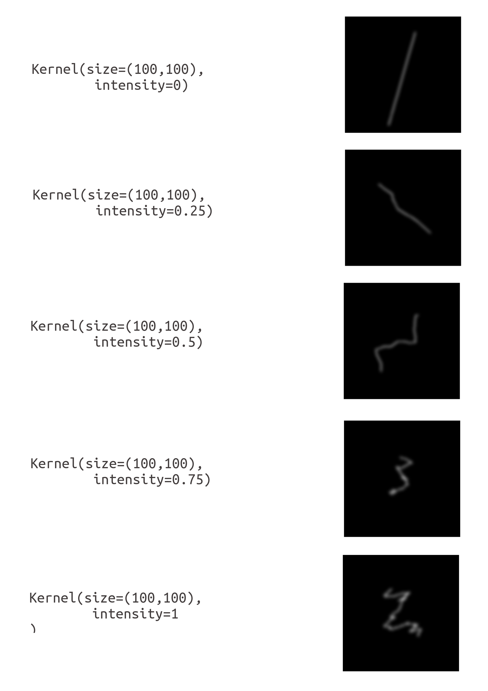

# MotionBlur

Generate authentic motion blur kernels (point spread functions) and apply them to images en masse.

Very efficient thanks to numpy's FFT based convolution and the optimised procedural generation of kernels. Intuitive API.

# Description

After installation, import the `Kernel` class from `motionblur.py` and use to your liking.

Here is how:

Initialise a `Kernel` instance with the parameters `size` (size of kernel matrix in pixels - as a tuple of integers) and `intensity`.

Intensity determines how non-linear and shaken the motion blur is. It must have a value between 0 and 1.
Zero is a linear motion and 1 a highly non-linear and often self intersecting motion.



Once a kernel is initialised, you can utilise a range of properties to make us of it.

```python
# Initialise Kernel
kernel = Kernel(size=(100, 100), intensity=0.2)

# Display kernel
kernel.displayKernel()

# Get kernel as numpy array
kernel.kernelMatrix

# Save kernel as image. (Do not show kernel, just save.)
kernel.displayKernel(save_to="./my_file.png", show=False)

# load image or get image path
image1_path = "./image1.png"
image2 = PIL.Image.open("./image2.png")

# apply motion blur (returns PIL.Image instance of blurred image)
blurred1 = kernel.applyTo(image1_path)

blurred2 = kernel.applyTo(image2)

# if you need the dimension of the blurred image to be the same
# as the original image, pass `keep_image_dim=True`
blurred_same = kernel.applyTo(image2, keep_image_dim=True)

# show result
blurred1.show()

# or save to file
blurred2.save("./output2.png", "PNG")
```


# Installation

In order to set up the necessary environment:

1. create an environment `MotionBlur` with the help of conda,
    ```
    conda env create - f environment.yaml
    ```
2. activate the new environment with
    ```
    conda activate MotionBlur
    ```

Or simply install numpy, pillow and scipy manually.
